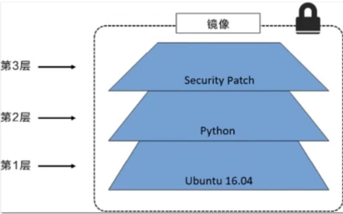
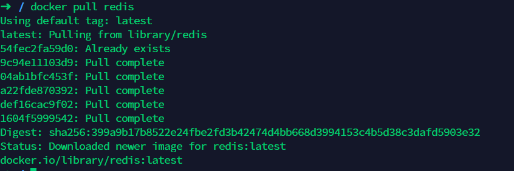

# docker

## 1.安装
按照官方文档安装

https://docs.docker.com/engine/install/

## 2.常用命令
### 2.1 帮助命令
```
docker version # 版本
docker info # 显示docker的系统信息，包括镜像和容器的数量
docker 命令 --help # 查看帮助文档
```
### 2.2 镜像命令
```
docker images # 查看本地所有镜像
    [-a]  隐藏镜像也显示
    [-q]  只显示镜像id
    [-aq] 显示所有的镜像的id

docker search # 在仓库中搜索镜像

docker pull # 下载镜像

docker rmi 镜像id # 删除镜像
    [-f] 在创建了容器的情况下也强制删除镜像
    [-f $(docker images -aq)]  把所有的镜像的id作为参数传到-f后面  即删除本地所有镜像
```
### 2.3 容器命令
```
docker run 镜像id # 新建容器并启动
    [-d] 创建容器后在后台运行，容器后台运行时必须要有一个前台进程或者提供服务，否则会自动停止
    [-it] 交互式运行 即进入容器
    [--name] 容器名
    [-p] 指定端口映射 如:-p 主机端口3344：容器端口80 即通过主机的3344可以访问容器的80

docker ps # 列出所有运行的容器 
    [-a] 显示所有容器 包括没有运行的
    [-q] 只显示容器id

docker rm 容器id # 删除指定容器

docker start 容器id # 启动容器

docker restart 容器id # 重启容器

docker stop 容器id # 停止当前正在运行的容器

docker kill 容器id # 强制停止当前容器

docker stats 各个容器内存使用情况
```

### 2.4 其他命令
>查看日志
```
docker logs [] 容器id
    [-t] 打印日志时显示写入的时间
    [-f] 实时打印
    [--tail n] 需要显示的日志条数 
```
>查看容器中的进程信息
```
docker top 容器id
```
>查看镜像的元数据
```
docker inspect 容器id
```
>进入正在运行的容器
```
docker exec -it 容器id /bin/bash # 进入容器新打开一个终端
docker attach 容器id # 进入容器正在运行的终端
```
>容器和主机间拷贝文件
```
docker ps 容器id:容器内路径  主机路径
docker ps 主机路径  容器id:容器内路径
```
### 2.5 例子
#### 2.6 安装nginx
```
docker search nginx # 搜索
docker pull nginx # 拉取
docker run -d -p 3344:80 --name nginx nginx # 后台运行 指定映射端口和名字
curl localhost:3344 # 查看本机的3344端口  看到nginx运行
```

## 3.镜像加载原理
docker镜像基于联合文件系统，对文件的每一次修改都作为一个新的分层叠加。

比如ubuntu的镜像，每加一个新的包，就叠加了一个新的层，构成一个新的镜像；比如文件5更新版本到文件7之后，又叠加一个新的层，得到一个新的镜像。




镜像下载时，这个镜像下的所有层都会下载，而且是一层一层的下载。




Docker 镜像都是只读的，当容器启动时，一个新的可写层加载到镜像的顶部！这一层就是我们通常说的容器层，容器之下的都叫镜像层！

优势：有多个镜像都从相同的Base镜像构建而来，那么宿主机只需在磁盘上保留一份base镜像，同时内存中也只需要加载一份base镜像，这样就可以为所有的容器服务了，而且镜像的每一层都可以被共享。比如所有的Linux系统的镜像都共享本机的Uinx内核，不同版本的ubuntu镜像都共享一个ubuntu镜像的一些信息。