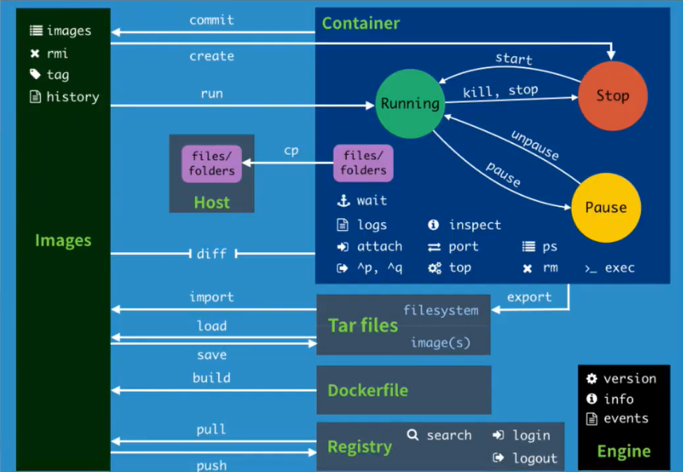
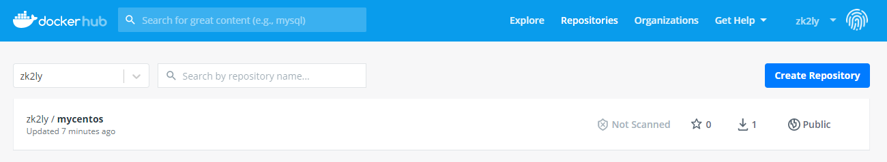

# docker
- [docker](#docker)
  - [1.安装](#1安装)
  - [2.常用命令](#2常用命令)
    - [2.1 帮助命令](#21-帮助命令)
    - [2.2 镜像命令](#22-镜像命令)
    - [2.3 容器命令](#23-容器命令)
    - [2.4 其他命令](#24-其他命令)
    - [2.5 例子](#25-例子)
      - [2.6 安装nginx](#26-安装nginx)
  - [3.提交镜像](#3提交镜像)
    - [3.1 镜像原理](#31-镜像原理)
    - [3.2 提交命令](#32-提交命令)
  - [4.容器数据卷](#4容器数据卷)
  - [5.Dockerfile](#5dockerfile)
  - [6.暂时用不到，但是很重要的](#6暂时用不到但是很重要的)
## 1.安装
按照官方文档安装

https://docs.docker.com/engine/install/

## 2.常用命令


### 2.1 帮助命令
```
docker version # 版本
docker info # 显示docker的系统信息，包括镜像和容器的数量
docker 命令 --help # 查看帮助文档
```
### 2.2 镜像命令
```
docker images # 查看本地所有镜像
    [-a]  隐藏镜像也显示
    [-q]  只显示镜像id
    [-aq] 显示所有的镜像的id

docker search # 在仓库中搜索镜像

docker pull # 下载镜像

docker rmi 镜像id # 删除镜像
    [-f] 在创建了容器的情况下也强制删除镜像
    [-f $(docker images -aq)]  把所有的镜像的id作为参数传到-f后面  即删除本地所有镜像
```
### 2.3 容器命令
```
docker run 镜像id # 新建容器并启动
    [-d] 创建容器后在后台运行，容器后台运行时必须要有一个前台进程或者提供服务，否则会自动停止
    [-it] 交互式运行 即进入容器
    [--name] 容器名
    [-p] 指定端口映射 如:-p 主机端口3344：容器端口80 即通过主机的3344可以访问容器的80

docker ps # 列出所有运行的容器 
    [-a] 显示所有容器 包括没有运行的
    [-q] 只显示容器id

docker rm 容器id # 删除指定容器

docker start 容器id # 启动容器

docker restart 容器id # 重启容器

docker stop 容器id # 停止当前正在运行的容器

docker kill 容器id # 强制停止当前容器

docker stats 各个容器内存使用情况
```

### 2.4 其他命令
>查看日志
```
docker logs [] 容器id
    [-t] 打印日志时显示写入的时间
    [-f] 实时打印
    [--tail n] 需要显示的日志条数 
```
>查看容器中的进程信息
```
docker top 容器id
```
>查看镜像的元数据
```
docker inspect 容器id
```
>进入正在运行的容器
```
docker exec -it 容器id /bin/bash # 进入容器新打开一个终端
docker attach 容器id # 进入容器正在运行的终端
```
>容器和主机间拷贝文件
```
docker ps 容器id:容器内路径  主机路径
docker ps 主机路径  容器id:容器内路径
```
### 2.5 例子
#### 2.6 安装nginx
```
docker search nginx # 搜索
docker pull nginx # 拉取
docker run -d -p 3344:80 --name nginx nginx # 后台运行 指定映射端口和名字
curl localhost:3344 # 查看本机的3344端口  看到nginx运行
```

## 3.提交镜像
### 3.1 镜像原理
docker镜像基于联合文件系统，对文件的每一次修改都作为一个新的分层叠加。

比如ubuntu的镜像，每加一个新的包，就叠加了一个新的层，构成一个新的镜像；比如文件5更新版本到文件7之后，又叠加一个新的层，得到一个新的镜像。


镜像下载时，这个镜像下的所有层都会下载，而且是一层一层的下载。


Docker 镜像都是只读的，当容器启动时，一个新的可写层加载到镜像的顶部！这一层就是我们通常说的容器层，容器之下的都叫镜像层！


优势：有多个镜像都从相同的Base镜像构建而来，那么宿主机只需在磁盘上保留一份base镜像，同时内存中也只需要加载一份base镜像，这样就可以为所有的容器服务了，而且镜像的每一层都可以被共享。比如所有的Linux系统的镜像都共享本机的Uinx内核，不同版本的ubuntu镜像都共享一个ubuntu镜像的一些信息。

### 3.2 提交命令
把一个更改后的容器提交成一个新的镜像
```
docker commit -m 描述信息 -a 作者 容器id 名称:[版本号TAG]
```
例如
```
docker run -it centos /bin/bash  # 创建一个容器并进入  
mkdir zkkkkkkkkkkkkkkkk  # 修改容器后退出容器
docker commit -m "test commit" -a "zhangk" 9 centos_zk:1.0  # 提交成新的镜像
docker images  # 查看新的镜像 

REPOSITORY   TAG       IMAGE ID       CREATED         SIZE
centos_zk    1.0       4ea71881e9f7   5 seconds ago   209MB
```

## 4.容器数据卷
如果一个容器是mysql服务，那么删除这个容器，mysql的数据也都没有了，不安全；如果每次修改容器文件都要进入容器内，不方便。因此有了容器数据卷，实质是容器的目录挂载到主机上。
```
# 指定路径挂载
docker run -v 主机目录:容器内目录 镜像
docker run -v /home/zk:/home centos

# 具名挂载：不指定路径，给容器数据卷命名
docker run -v 数据卷名称：容器内目录 镜像
docker run -v root_home:/home centos

# 匿名挂载：不指定路径，不给容器数据卷命名
docker run -v 容器内目录 镜像
docker run -v /home centos

# 如果不指定挂载路径，数据卷通常都在目录/var/lib/docker/volumes/xxxx/_data下
docker volume ls  # 查看目录下所有的数据卷
docker volume inspect 数据卷名称  # 查看一下这个卷
```
容器目录挂载到主机之后，两边的数据是互通的，修改一个另一个也修改，其实容器没有启动也是一样，如果要限制容器修改目录中的内容，可以在挂载时设置读写权限。
```
ro #readonly 只读
rw #readwrite 可读可写
docker run -v root_home:/home:ro centos
docker run -v root_home:/home:rw centos

# ro 只要看到ro就说明这个路径只能通过宿主机来操作，容器内部是无法操作！
```

## 5.Dockerfile
自己要建立一个新镜像时，可以通过dockerfile文件生成。
>命令
```
FROM				# 基础镜像，一切从这里开始构建
MAINTAINER			# 镜像是谁写的， 姓名+邮箱
RUN					# 镜像构建的时候需要运行的命令
ADD					# 添加文件到容器内  格式：ADD 添加内容 添加目录
WORKDIR				# 镜像的工作目录
VOLUME				# 挂载的目录
EXPOSE				# 保留端口配置
CMD					# 指定这个容器启动的时候要运行的命令，只有最后一个会生效，可被替代。
ENTRYPOINT			# 指定这个容器启动的时候要运行的命令，可以追加命令
ONBUILD				# 当构建一个被继承 DockerFile 这个时候就会运行ONBUILD的指令，触发指令。
COPY				# 类似ADD，将我们文件拷贝到镜像中
ENV					# 构建的时候设置环境变量！
```
>构建一个自己的centos
```
# 1.创建dockerfile文档
vim dockerfile  

# 2.写入内容
FROM centos
MAINTAINER zhangk<377xxxx@qq.com>

ENV MYPATH /usr/local
WORKDIR $MYPATH

RUN yum -y install vim
RUN yum -y install net-tools

EXPOSE 80

CMD /bin/bash

# 3.创建镜像
docker build -f 文件 -t 镜像名:版本号TAG .   最后有一个点别忘记了
docker build -f dockerfile -t mycentos:1.0 .

# 4.测试运行
docker run -it mycentos:1.0  # 这里指定TAG，否则默认的TAG是latest
```
可以用`docker history 镜像id`的命令查看一个镜像的各层，即他的创建过程。
```
docker history nginx

IMAGE          CREATED       CREATED BY                                      SIZE      COMMENT
ae2feff98a0c   3 weeks ago   /bin/sh -c #(nop)  CMD ["nginx" "-g" "daemon…   0B        
<missing>      3 weeks ago   /bin/sh -c #(nop)  STOPSIGNAL SIGQUIT           0B        
<missing>      3 weeks ago   /bin/sh -c #(nop)  EXPOSE 80                    0B        
<missing>      3 weeks ago   /bin/sh -c #(nop)  ENTRYPOINT ["/docker-entr…   0B        
<missing>      3 weeks ago   /bin/sh -c #(nop) COPY file:0fd5fca330dcd6a7…   1.04kB    
<missing>      3 weeks ago   /bin/sh -c #(nop) COPY file:0b866ff3fc1ef5b0…   1.96kB    
<missing>      3 weeks ago   /bin/sh -c #(nop) COPY file:e7e183879c35719c…   1.2kB     
<missing>      3 weeks ago   /bin/sh -c set -x     && addgroup --system -…   63.7MB    
<missing>      3 weeks ago   /bin/sh -c #(nop)  ENV PKG_RELEASE=1~buster     0B        
<missing>      3 weeks ago   /bin/sh -c #(nop)  ENV NJS_VERSION=0.5.0        0B        
<missing>      3 weeks ago   /bin/sh -c #(nop)  ENV NGINX_VERSION=1.19.6     0B        
<missing>      3 weeks ago   /bin/sh -c #(nop)  LABEL maintainer=NGINX Do…   0B        
<missing>      3 weeks ago   /bin/sh -c #(nop)  CMD ["bash"]                 0B        
<missing>      3 weeks ago   /bin/sh -c #(nop) ADD file:3a7bff4e139bcacc5…   69.2MB 
```
>发布镜像
```
# 登陆dockerhub
docker login -u zk2ly 

# 发布到远程仓库
docker push mycentos:1.0 # 报错 因为默认上传到dockerhub的仓库
docker build -f dockerfile -t zk2ly/mycentos:1.0 # 方法一：创建时添加用户名
docker tag mycentos:1.0 zk2ly/mycentos:1.0 # 方法二：改变tag生成另一个新镜像
docker push zk2ly/mycentos:1.0
```
发布成功

下图中的save/load是压缩和解压，不过一般不把镜像作为压缩包传递，一般都是发布到远程仓库，需要用再拉取到本地。


## 6.暂时用不到，但是很重要的
docker网络 

docker compose 定义运行多个容器

docker swarm 集群部署

k8s 集群部署

go语言 