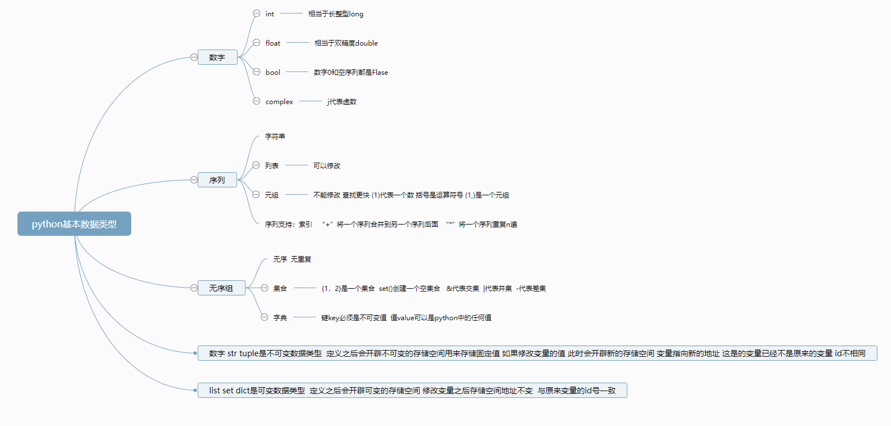
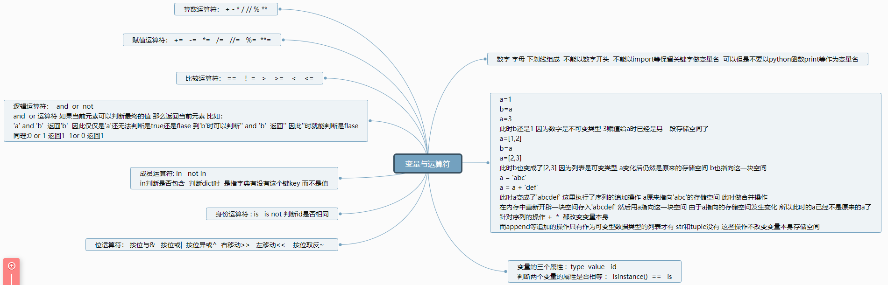
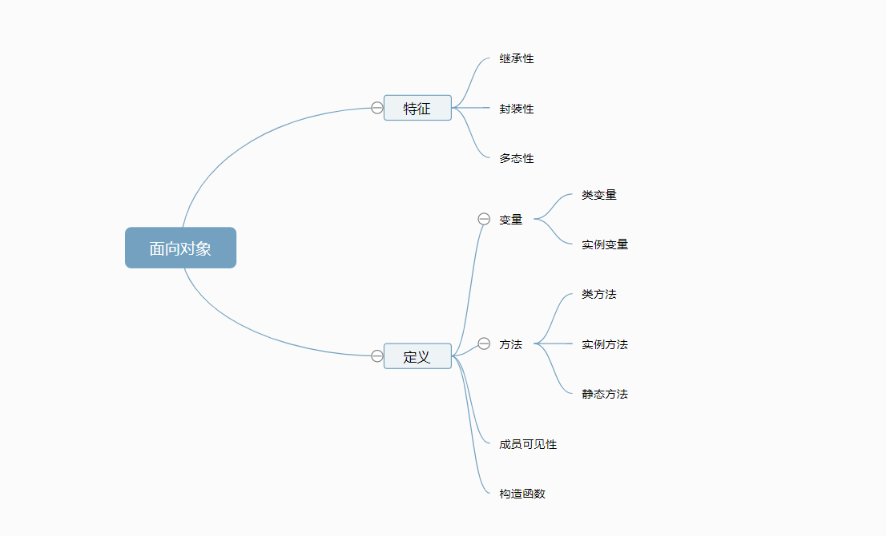

# python基础

要使用却没有的内容搜索浏览器或者查找https://www.runoob.com/python3/python3-stdlib.html

然后补全到笔记中

- [python基础](#python基础)
  - [1.基本数据类型](#1基本数据类型)
  - [2.变量与运算符](#2变量与运算符)
  - [3.面向对象](#3面向对象)
  - [4.函数](#4函数)
    - [4-1.封包和解包](#4-1封包和解包)
    - [4-2.函数参数](#4-2函数参数)
  - [5.正则表达式](#5正则表达式)
    - [5-1.查找](#5-1查找)
      - [5-1-1.字符集](#5-1-1字符集)
      - [5-1-2.概括字符集](#5-1-2概括字符集)
      - [5-1-3.数量词](#5-1-3数量词)
      - [5-1-4. 边界匹配](#5-1-4-边界匹配)
      - [5-1-5.匹配模式](#5-1-5匹配模式)
      - [5-1-6.match&search和分组](#5-1-6matchsearch和分组)
    - [5-2.查找并替换](#5-2查找并替换)
  - [6.JSON](#6json)
  - [7.枚举](#7枚举)
  - [8.函数式编程](#8函数式编程)
    - [8-1.闭包](#8-1闭包)
    - [8-2.匿名函数](#8-2匿名函数)
    - [8-3.三目运算](#8-3三目运算)
    - [8-4.map reduce](#8-4map-reduce)
    - [8-5.filter](#8-5filter)
    - [8-6.组合运算](#8-6组合运算)
  - [9.装饰器](#9装饰器)
  - [10.爬虫](#10爬虫)
  - [11.杂记](#11杂记)
    - [11-1.用字典映射代替switch](#11-1用字典映射代替switch)
    - [11-2.列表推导式](#11-2列表推导式)
    - [11-3.None](#11-3none)
    - [11-4.函数bool值的判断](#11-4函数bool值的判断)

## 1.基本数据类型



## 2.变量与运算符



## 3.面向对象



```python
# 定义
#　类名一般用驼峰形式  函数名用小写加下划线
class Student():
    #　类变量  应当与实例无关
    count = 0
    __private = True   # 私有的 仅变量名或方法名前面加两个下划线

    def __init__(self, name, age):
        #　构造函数：创建实例时自动调用 不能有返回值 自动返回None 实际也是一个实例方法
        #　这里的变量是：实例变量  
        #　self代表当前的这个实例 也可以用this等任意字代替 一般用self
        #　如果没有self则不是实例变量 name=name这里的name是函数内部的局部变量　构造函数调用完毕后删除
        self.name = name
        self.age = age 
        # 实例函数中调用类变量的两种方法 但是最好不要在实例中调用类变量
        self.__class__.count += 1
        print('录入第%d个学生  姓名:%s,年龄:%d'%(Student.count, self.name, self.age))  

    #　定义一个实例方法 要传入self  是当前实例可以调用的一个方法 
    def do_homework(self):
        print(self.name, 'do homework')

    # 类方法  决定类方法主要是靠装饰器@classmethod 而不是cls 因为cls是可变的
    # cls代表当前这个类
    @classmethod
    def plus_sum(cls):
        cls.count += 1
        print('等待第%d个学生'%cls.count)

    #　静态方法 和类和对象关系不大 
    @staticmethod
    def static():
        print('this is staticmethod')

s = Student('小王', 18)  # 实例化
s.do_homework()  #　调用实例方法
Student.plus_sum()  # 调用类方法
s.static()  # 调用静态方法
Student.static()
# print(Student.__private)  # 报错 不能从外部读取私有的变量或方法 
print(Student._Student__private)  #　强制读取:　因python内部其实是把私有变量或方法的名称改变了
print(Student.__dict__)
```

```python
#  继承
#　一个文件里最好只定义一个类
class Human():
    def __init__(self, name, age):
        self.name = name
        self.age = age
    
    def info(self):
        print('Human:', self.name, self.age)


# 可以没有构造函数和方法
class Student1(Human):
    pass

s1 = Student1('张', 25)
s1.info()

class Student2(Human):
    # 重新定义构造函数 需要传入父类需要的所有参数 以及当前子类额外需要的参数
    def __init__(self, score, name, age):
        # 通过 "super(类名,实例)"代表当前实例所属类的父类　 然后调用父类的构造函数
        super(Student2, self).__init__(name, age)
        self.score = score  

    def s_info(self):
        # 通过super调用父类的方法
        super(Student2, self).info()
        print('Student:', self.name, self.age, self.score)

s2 = Student2('李', 24 ,90)
s2.s_info()
```

## 4.函数

### 4-1.封包和解包

- 序列封包：程序把多个值赋给一个变量时，Python会自动将多个值封装成元组
- 序列解包：程序允许将序列（字符串、元组、列表等）直接赋值给多个变量，此时序列的各元素会被依次赋值给每个变量（要求序列的元素个数和变量个数相等）

```python
# 封包
res = 1,2,3
print(res)  # (1,2,3)

# 解包
x, y, z = res
```

### 4-2.函数参数

函数定义或者调用时 ，参数可以写成“key=value”这种形式，但是一旦有一个“=”号出现 后面的参数都必须用这种形式

- 形参 ：函数定义的参数
- 实参：函数调用传入的参数
- 关键字参数：函数调用时形如“age=18”，是为了提高代码可读性
- 默认参数：函数定义时形如"age=18"
- 可变参数：*arg
- 关键字可变参数：*kw

```python
def get_userinfo(username,password):  # 形参
    pass

get_userinfo('laravelvue','123')  # 实参

get_userinfo(username='laravelvue',password='123') # 关键字参数

def get_ipinfo(ip,address='0.0.0.0')  # 默认参数

def get_equipmentinfo(*param)  # 可变参数  *是解包一维元组 得到多个参数

get_equipmentinfo('app','mobile')  # 可以传递多个参数 多个参数打包成一个一维元组

info = ('wxapp','mobile')  # 如果传递元组、列表等，需要加上星号

get_equipmentinfo(*info)#加上星号相当于解包成单个参数，所以函数获取到的就是一个一维元组，如果不加星号，那么得到的是二维元组

#可变关键字参数
#想要传可变关键字，必须有两个星号，如果不加，就不能传递可变关键字参数
def city_temp(**param):  # 第二个*解包  一个键值对赋给一个变量 第一个*值赋给键
    for key,value in param.items():
    print(key,':',value)
    
city_temp(bj='31c',sh='36') #传递的是元组，函数接收解析之后是字典


info = {'bj':'31c','sh':'36c'}  #如果想直接传递一个字典，必须需要加上两个星号
city_temp(**info)  # 第二个*解包  一个键值对赋给一个变量 第一个*值赋给键
```

## 5.正则表达式

### 5-1.查找

#### 5-1-1.字符集

```  python
import re

s = '1a1,1b1,1c1,1d1,1f1'
re.findall('1[a]1', s)  # 匹配1a1
re.findall('1[ab]1', s)  # 匹配1a1 或者 1b1
re.findall('1[^a]1', s)  # 匹配1a1除外的其他

# 类似的
re.findall('[0-9]', s)  # 匹配数字
re.findall('^[0-9]', s)  # 匹配非数字
re.findall('[A-Za-z]', s)  # 匹配字母
```

#### 5-1-2.概括字符集

```python
import re

re.findall('/d', s)  # 匹配数字 [0-9]
re.findall('/D', s)  # 匹配非数字  ^[0-9]

re.findall('/w', s)  # 匹配数字字母下划线 [0-9A-Za-z_]
re.findall('/W', s)  # 匹配非数字字母下划线  ^[0-9A-Za-z_]   $ % 之类的

re.findall('/s', s)  # 匹配空白字符  空格 \n \t \r等
re.findall('/S', s)  # 匹配非空白字符

re.findall('.', s)  # 匹配换行符以外所有字符
```

#### 5-1-3.数量词

```  python
import re

re.findall('[0-9]{3}', s)  # 连续匹配3个数字
re.findall('(python){3}', s)  # 连续匹配字符串'python'三次
re.findall('[0-9]{3,6}', s)  # 连续匹配3-6个数字 匹配到3个时不停止匹配
re.findall('[0-9]{3,6}?', s)  # 连续匹配3-6个数字 匹配到3个时停止匹配


re.findall('a*', s)  # 匹配a字母0次或者无限次,如: '','a','aa','aaaa'……
re.findall('a+', s)  # 匹配a字母1次或者无限次
re.findall('a?', s)  # 匹配a字母0次1次

re.findall('\+', s)  # 匹配+号
```

#### 5-1-4. 边界匹配

```python
import re

re.findall('^\d{3}$', s)  # ^代表字符串s的开头 $代表结尾 这里是匹配一个仅3个数字组成的字符串
re.findall('^\d{3}', s)  # 匹配三个数字开头的字符串
re.findall('\d{3}$', s)  # 匹配三个数字结尾的字符串
```

#### 5-1-5.匹配模式

```python
import re

re.findall('[a-z]', s, re.I)  # 匹配字符不区分大小写
re.findall('.', s, re.S)  # .匹配所有字符 包括换行符
re.findall('.', s, re.S | re.I)  
```

#### 5-1-6.match&search和分组

```python
import re

s = 'life is short, i use python, i love python, 222'
r = re.match('\d', s)  # re.findall('^\d', s) 匹配开头的这个数字  
r = re.search('\d', s)  # 返回整个字符串中第一个数字 re.findall('\d{1}', s)

# findall返回列表 match和search返回一个对象 分组后得到值
re.search('life.*python').group()  # 相当于group(0) 返回匹配的整个字符串‘life is short, i use python’
re.search('life(.*)python').group(1)  # 返回分组1 ‘ is short, i use ’  
re.search('life(.*)python(.*)python').group(1,2)  # 返回分组1，2 [' is short, i use ', ', i love ']
re.search('life(.*)python(.*)python').groups()  # 返回所有分组
```

### 5-2.查找并替换

```python
import re

s = 'pythonc++javac++phpC++'
re.sub('c++', 'go', s, count=0, flags=re.I) # 输出'pythongojavagophpgo' count=0表示无限制替换

# 第二个替换参数可以是函数
def convert(value):
    value.group()  # 取到匹配的字符
    return '!!!' + value + '!!!'

re.sub('c++', convert, s, count=1, flags=re.I)  # 输出'python!!!c++!!!javac++phpC++'
```

## 6.JSON

json：一种轻量级的**数据交换格式**

json对象：json本身是一种数据结构  

json字符串：字符串是json的表现形式

**json的obejct用字符串表示：**

'{“name”:"zk"，“age”:18， “flag”:flase}' 规范格式里面必须用双引号 ，非字符串字符不用  bool类小写

**json的array用字符串表示：**

'[{“name”:"zk"，“age”:18}, {“name”:"zk"，“age”:18}]'

json字符串在不同语言中**反序列化**成不同的数据结构 python中解析成字典

json数组在python中**反序列化**成列表

```
# json数据结构(json对象)到python语言的对应表
# json不管是什么数据结构 它的表现形式都是字符串 但是组织形式不一样
# 左到右：反序列化
# 右到左：序列化
object       dict
array        list
string       str
number       int/float
true/false   True/False
null         None
```

```python
# 反序列化
import json

json_str = '{"name":"zk", "age":18, "flags":false}'
data = json.loads(json_str)  
print(data) #  字典 {'name': 'zk', 'age': 18, 'flags': False} bool类型自动大写

json_str = '[{"name":"zk", "age":18, "flags":false}, {"name":"zk", "age":18}]'
data = json.loads(json_str)  
print(data) # 列表 [{'name': 'zk', 'age': 18, 'flags': False}, {'name': 'zk', 'age': 18}]
```

```python
# 序列化
import json
data = {'name': 'zk', 'age': 18, 'flags': False}
json_str = json.dumps(data)
print(json_str)
```

## 7.枚举

```python
# 假如在数据库中存入YELLOW GREEN BLACK RED四种vip类型  可以存入1234四个数字分别代表
# 在python中可以这样表达他们的对应关系

# 方法一：全局变量
YELLOW=1 
GREEN=2 
BLACK=3 
RED=4

# 方法二:字典
vip = {"YELLOW":1, "GREEN":2, "BLACK":3, "RED":4}

# 方法三：类
class Vip():
    YELLOW=1 
	GREEN=2 
	BLACK=3 
	RED=4

# 上面三种方法的缺点：1.无法阻止对数值进行更改 2.不能保证标签唯一(可以定义两个一样的标签)

# 方法四：枚举  值不允许更改  标签不能重复
from enum import Enum

class Vip(Enum):
    YELLOW=1 
	GREEN=2 
	BLACK=3 
	RED=4

# 使用    
print(Vip.YELLOW)  # 输出Vip.YELLOW 一个枚举对象
print(Vip.YELLOW.name) # 标签  ’YELLOW‘
print(Vip.YELLOW.value)  # 值 1
print(Vip(1).name)  # 1对应的标签名  输出YELLOW

for i in Vip:
    print(i)  # 打印四个枚举对象Vip.YELLOW  Vip.GREEN  Vip.BLACK  Vip.RED

# 注意 
# 枚举两个标签对应一个值 后面的标签都会被认为是第一个标签的别名 
class Vip(Enum):
    YELLOW=1 
	HUANG=1   # YELLOW的一个别名
	BLACK=3 
	RED=4

for i in Vip:
    print(i)  # 此时不打印别名的对象
    
for i in Vip.__members__:
    print(i)  # 打印别名的对象

# 强制用数字做值 且 不允许值重复
from enum impoer intEnum, unique

@ unique
class Vip(intEnum):
    YELLOW=1
    GREEN=2
    BLACK=3
    RED=4
```

## 8.函数式编程

其他语言中 函数是一段可执行的代码 编译后固化

python中一切皆对象 所以函数也是一个实例化的类

因此python可以把一个函数当作参数传给另一个函数 也可以在一个函数中返回另一个函数 也可以把一个函数赋值给变量  因为函数本质是一个类的实例

### 8-1.闭包

```python
# 闭包:函数 + 定义函数时的环境变量(不能是全局变量和函数内的局部变量)
# 函数里定义了一个变量k和一个函数axk,组成一个闭包 最后返回这个带有环境变量的函数(闭包)
def plus_k():
    k = 10
    def axk(a):
        return a*k
    
    return axk

k=20  # 改变全局的k值 不影响闭包里面的环境变量k值
f = plus_k()
print(f(5))  # 输出50

# 问题：一个旅行者当前位置是0，走3步到3，再走5步到8，用非闭包和闭包两种方法编程
# 非闭包
current_pos = 0
def go(distance):
    global current_pos  # 声明这是一个全局变量
    new_pos = current_pos + distance  # 当调用current_pos时 当前函数内找不到 自动到上一级去找
    current_pos = new_pos  # 当给current_pos赋值时 函数自动认为这是一个局部变量 因此要在前面声明
    return new_pos

print(go(3))  # 输出3
print(go(5))  # 输出8


# 闭包
def people_position(pos):
    current_pos = pos
    def go(distance):
        nonlocal current_pos  # 强调current_pos是非局部变量
        new_pos = current_pos + distance  
        current_pos = new_pos  
        return current_pos

    return go

tourist = people_position(0)
print(tourist(3))  # 输出3
print(tourist(5))  # 输出8

# 闭包可以实现一种安全的环境变量，减少全局变量的定义
# 闭包的环境变量常驻内存 不会因为调用了闭包内的函数而消失
```

### 8-2.匿名函数

```python
#  lambda parameter_list : expression   (参数列表,表达式)
def add(x,y):
    return x+y

lambda x,y:x+y
```

### 8-3.三目运算

```python
# True if addition else False
if x>y:
    return x
else:
    return y 

x if x>y else y
```

### 8-4.map reduce

```python
#  map:输入一个列表 每个元素做映射 输出一个列表
def square(x):
    return x*x

list_x = [1,2,3]

r = map(square, list_x) 
print(list(r))   # [1, 4, 9]

# reduce:输入一个列表 每个元素循环运算 输出一个值 (函数必须是两个值的运算)
from functools import reduce
def add(x,y):
    return x+y

list_x = [1,2,3]

r = reduce(add, list_x, 0)  # 开始x=0,y=list_x[0]得到的值赋给x 然后list_x[1]赋给y 循环下去  r=6
```

### 8-5.filter

```python
#  filter(返回1/0的函数，list)  列表中每一个元素到函数中做判断  最后输出判断为True的元素
list_x = [1,2,3]
r = filter(lambda x:x if x>1.5 else 0, list_x)  # list(r) = [2,3]
```

### 8-6.组合运算

```python
list_x = [1,2,3,4,5]
list_y = [5,4,3,2,1]

r = map(lambda x, y: x if x>y else y, list_x, list_y)  # list(r)=[5,4,3,4,5]
# list_x和list_y不一样长时  输出的列表长度等于短的列表
```

## 9.装饰器

函数：对内修改保持封闭，对外拓展保持开放

就是一个函数定义好了 就不要随便修改 但是可以向外拓展它的功能

装饰器就是可以在不改变函数的调用方式的前提下，拓展函数功能的一种方式

```python
#  假设有100个函数，要为每一个函数增加打印当前时间的功能
def f1():
    print('This is f1')
    
def f100():
    print('This is f100')
    
# 方法一：违反了函数对内修改封闭的原则 容易引发项目的bug  并且要添加一百次 繁琐
def f1():
    print(time.time())
    print('This is f1')
    
# 方法二：改变了函数的调用规则 项目中大量调用的函数需要更改 并且要定义一百个新函数 繁琐
def new_f1(func):
    print(time.time())
    func()
    
new_f1(f1)  # 调用

# 方法三:装饰器 只需要把定义好的装饰器夹在函数定义前 就可以拓展函数的功能
def decorator(func):
    def wrapper():
        print(time.time())
   		func()
    return wrapper

@decorator 
def f1():
    print('This is f1')

@decorator    
def f100():
    print('This is f100')
    
# 可以接受任意参数的装饰器
def decorator(func):
    def wrapper(*arg, **kw):
        print(time.time())
   		func(*arg, **kw)
    return wrapper
```

## 10.爬虫


## 11.杂记

### 11-1.用字典映射代替switch

```c
# c
switch(day){
    case 0:
        name = 'Sunday';
        break;
    case 1:
        name = 'Monday';
        break;
    default:
        name = 'Unknow';
        break;
}
```

```python
# python
switcher = {
    0 : 'Sunday',
    1 : 'Monday',
}

switcher[0] # 'Sunday'
switcher.get(3, 'Unknow')  # 'Unknow'  .get方法可以设置没有的键的返回值
```

上面只能模拟返回值 但是switch语句中可以写代码和调用函数

```python
def add10(x):
    return x+10

def mul10(x):
    return x*10

def defalut(x):
    return x

switcher = {
    '0' : add10,
    '1' : mul10,
}

r = switcher.get(0, defalut)(5)  # 输入值返回一个函数 ，然后用()调用这个函数并传参
```

### 11-2.列表推导式

元组 列表 集合也都可以推导

```python
a = [1,2,3]
b = [i**2 for i in a]  # b=[1,4,9]
b = [i**2 for i in a if i>1.5]  # b=[4,9] 
b = {i**2 for i in a if i>1.5}  # b={4，9}

a = {'张三':18, '李四':16, '王五':22}
b = [key for key,value in a.items()]  # b = ['张三', '李四', '王五']
b = (key for key,value in a.items())  # 返回一个生成器 因为元组时不可变的 
b = {value:key for key,value in a.items()}  # b = {18: '张三', 16: '李四', 22: '王五'}

```

### 11-3.None

不是空序列(list str tuple)   也不是0(int float)    不是False(bool)

```python
print(type(None))  # 'class NoneType'
```

### 11-4.函数bool值的判断

```python
# 在做if判断时 不管条件是什么都会转换成bool型 即bool(addition)
if addition:
    expression

def f():
    pass
bool(f)  # True

def f():
    def __len__(self):
        retuen 0
bool(f)  # False
```

定义一个函数时，判断它的bool类型，首先以定义的bool实例函数为准，没有的话则以定义的len实例函数为准，都没有则默认True

```python
def f():
    def __bool__(self):
        return False
    def __len__(self):
        return 2
    
bool(f)  # False 以__bool__为准
```
